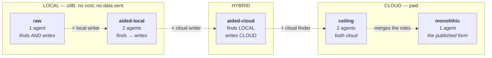
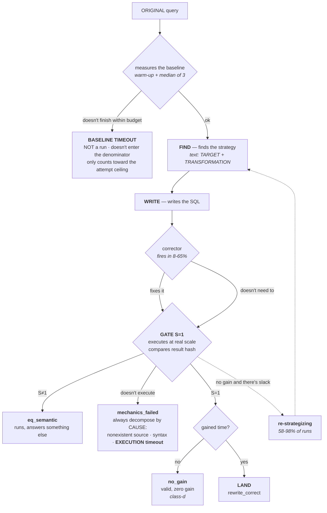

# F1 and F2 — Mermaid sketches *(20/09)*

> **Draft to become a vector figure** (TikZ, Inkscape, or draw.io) before submission.
> The Mermaid serves to close the **content and topology**; the finishing is a separate step.
> **Rule that applies to both:** they need to be legible in **grayscale** — EDBT is printed.
> Distinguish LOCAL × CLOUD by **shape and stroke** (solid rectangle × dashed hexagon), never by color alone.

---

## F1 — THE FIVE ARMS *(§1, right after the contract paragraph)*

> ### THIS IS **NOT** A SYSTEM-ARCHITECTURE DIAGRAM
>
> §1 opens by saying *"we do not propose a new optimizer"*, and §5.4 argues that the contribution is
> **a law about the design space**, not an architecture. F1 has to draw **the experiment**,
> not the software.
>
> | draw | do NOT draw |
> |---|---|
> | the 5 **configurations** and what changes between them | orchestration module, LangGraph, internal nodes |
> | **who finds** and **who writes**, in each one | arrow to the database, cache, executor, index advisor |
> | **local × cloud** (shape and stroke) | system name, logo, "Athena-2.0" in any box |
> | the **size** of the model in each box | anything that looks like a component we built |
>
> **Test before finalizing:** if a reviewer looks at F1 and can say *"their architecture is X"*,
> the figure is wrong — they'll evaluate an architecture we don't claim, which is the exact attack §5.4
> exists to disarm. What they have to be able to say is *"they measured five configurations"*.
>
> The **component** diagram is **F2**, in §3, and there it's legitimate: it's the **measurement instrument**,
> not a proposal.

**What it has to do:** give the vocabulary of the whole paper in one glance, and show for free that
**C3 is the architecture of the published systems**.

**Caption to write below:**
> *The five measured arms. The horizontal axis is the capacity progression: each arrow swaps **one**
> component. `monolithic` is the form the published systems instantiate; `ceiling` is the ceiling that
> that form reaches when decomposed.*

**Details the final version needs:**
- the **model name** in each box (`qwen3:8b`, `deepseek-v4-flash`) — the reader needs to know the size
- mark **`raw` and `monolithic` with the same shape** (1 agent) so the C2×C3 contrast jumps out
- **do not** draw an arrow from `raw` to `monolithic`: they are not comparable (local × cloud)

---

## F2 — THE STEP-BY-STEP OF A RUN *(§3, the harness)*

**What it has to do:** answer three reviewer questions at once — how we measure
equivalence, what each outcome is, and **why baseline timeout isn't a run**.

**Caption to write below:**
> *The path of a run. The S=1 gate compares the **hash of the result** of the rewrite against the original's,
> executing both at real scale — it is not an LLM-judge. A `baseline timeout` occurs before the
> pipeline runs and **is not counted as a run**: 537 of the 2,386 attempts (23%) ended this way.*

**Details the final version needs:**
- **highlight the `S=1`** — it's the instrument that distinguishes this work from those using an LLM-judge
- the **loops** (`re-strategizing`, `corrector`) in dashed stroke, with the measured rates alongside:
  this is what defeats the attack *"you tested a naive decomposition"*
- the **baseline timeout** box visually **OUTSIDE** the main flow — it's the point that
  confuses readers the most, and the figure has to make it obvious that it doesn't enter any rate
- in the `raw` arm, **FIND and WRITE are the same agent**: either a note, or a reduced version of the figure

---

## Data the captions cite *(all generated, 20/09)*

| | value |
|---|---|
| real runs | **1,849** across 25 cells |
| baseline timeouts | **537** (23% of 2,386 attempts) |
| corrector fires | 8-65% of runs, depending on the cell |
| re-strategizing | 58-98% of runs |
